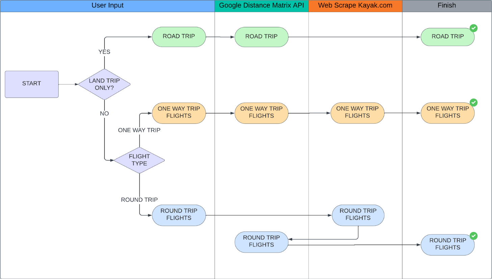

# Travel Planner 🌍✈️🏖️

## Overview 🔎
Welcome to **Travel Planner**, your ultimate tool for organizing multi-city trips with ease! Simply input your desired travel details, and let the program:

- Find the **cheapest days to fly** ✈️.
- Determine the **best routes** between destinations 🛣️⛴️⭐.
- Provide sassy recommendations for places to visit with the help of "Jessica, the Travel Sassystant" 😉⚙️.

## Features 🌐
1. **Flight Optimization**: Discover the most affordable travel dates for your trip using data from Kayak.
2. **Route Calculation**: Leverage Google Distance Matrix API to evaluate:
   - Driving 🚗
   - Rail 🚉
   - Bus 🚌
3. **Sassy Recommendations**: Meet Jessica, your travel sassystant, powered by ChatGPT 💎. She’ll not only suggest amazing spots but also add a sprinkle of humor to your planning.
4. **Interactive Front-End**: Streamlit integration for an intuitive and visually appealing user experience 🌍⚡.

## How It Works 📊
1. Input:
   - Your desired travel destinations 🗺️.
   - The range of dates for your trip 🕗.
   - Minimum and maximum number of travel days 🔢.

2. Output:
   - A curated list of affordable flights and routes ✈️🚗.
   - Tailored recommendations for attractions and experiences at each stop 🌐.

## Technologies Used 💻
- **Web Scraping**: Selenium for extracting data from Kayak 🔧.
- **APIs**:
  - Google Distance Matrix API for calculating travel times 🎯.
  - ChatGPT for generating recommendations ✨.
- **Front-End**: Streamlit for a dynamic and interactive interface 🚀.

## App logic 🧩


## Meet Jessica 💅✨
Jessica is no ordinary assistant. She’s your **travel sassystant** – offering insightful suggestions and a side of sass. Be ready to laugh, learn, and plan your next adventure with her witty commentary 😉.

## Getting Started ⚙️
1. Clone the repository:
   ```bash
   git clone https://github.com/DiverIntoData/python_travel_agency.git
   ```

2. Install dependencies:
   ```bash
   pip install -r requirements.txt
   ```

3. Run the app:
   ```bash
   streamlit run app.py
   ```

4. Start planning your dream trip! 🚀✈️

## Example Usage 🌐
- **Input**: 
   - Residency: Barcelona
   - Cities to visit: Berlin, Munich, Dormund, Amsterdam
   - Land trip: No
   - Trip mode: One-way flights
   - Transportation mode: Driving
   - Dates: 
      - Departure between 2025-01-01 and 2025-01-05
      - Return between 2025-01-10 and 2025-01-15
   - Number of days between 5 and 8
- **Output**:
  - Cheapest flights: 2025-01-06 (Barcelona to Munich), 2025-01-12 (Amsterdam to Barcelona).
  - Best route: Munich --> Berlin --> Dormund --> Amsterdam.
  - Jessica's tip: "Skip the tourist traps and try a local bakery in Munich. And no, you can't only eat schwarzwurst."

## Contributions 📢
We’d love your help to make Travel Planner even better! Feel free to fork the repository and submit pull requests. For major changes, open an issue to discuss your ideas first.

## License 📚
This project is licensed under the MIT License. See `LICENSE` for more information.

## Acknowledgements ❤️
Special thanks to:
- **Kayak** for flight data inspiration 🛩️.
- **Google** for route calculation API 🌍.
- **OpenAI** for powering Jessica’s witty brain 💎.
- **Streamlit** for a seamless user interface experience ✨.

## Presentation 📄
You can find the full presentation here: https://docs.google.com/presentation/d/1HiRMFgHW9V_TqlSnYJ_EkmJjJKj0bt1ww-1JP7dPysQ/edit?usp=sharing

## Let’s Get Traveling! 🚀✈️
Happy planning, and may your adventures be as exciting as Jessica’s sass! 🌍☀️✨.
